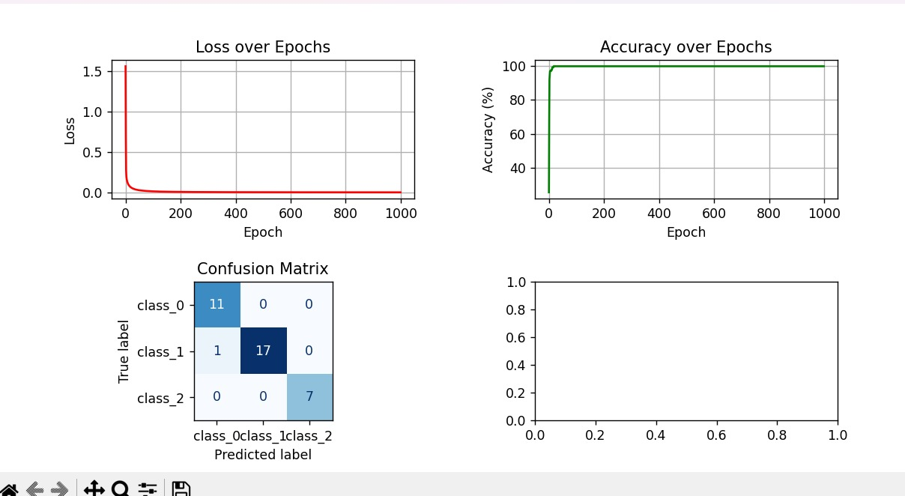
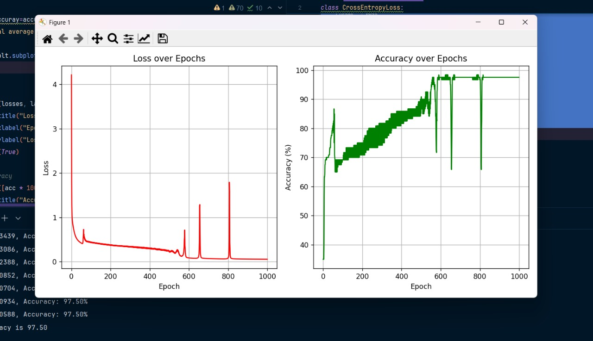

<h1 align="center"> Neural Network from Scratch (NumPy)</h1>

  <b>A fundamental two-hidden-layer neural network built from scratch using NumPy</b> 
  <i>Tested on Breast Cancer, Iris, and Wine datasets (Scikit-learn)</i>

<h2> Overview</h2>

This repository implements a basic <b>feed-forward neural network</b> with two hidden layers using only <code>NumPy</code>. 
It demonstrates key neural network components—Layers, Activations, and Loss functions—applied to three standard machine learning datasets.

<h2> Why This Exists</h2>

When I first got into <b>Machine Learning</b>, I came across a video (<a href="https://youtu.be/cAkMcPfY_Ns?si=lO05tzfFb-1lY0ro" target="_blank">this one</a>) that explained how neural networks work at the lowest level , from scratch, using only NumPy.  
That video inspired me to build my own version completely from the ground up, understanding every mathematical and logical step behind it rather than relying on libraries.  

My ultimate goal with this project is to gradually extend this framework — from small datasets like <b>Breast Cancer</b> and <b>Iris</b> — all the way up to training on the <b>MNIST handwritten digits dataset</b>.

<h2> 1. Core Neural Network Components</h2>

<table>
  <thead>
    <tr>
      <th>Component</th>
      <th>File</th>
      <th>Key Implementation Details</th>
    </tr>
  </thead>
  <tbody>
    <tr>
      <td><b>Dense Layer</b></td>
      <td><code>layers/dense.py</code></td>
      <td>
        Initializes weights using He initialization (<code>np.sqrt(2 / inputs)</code>). 
        Implements forward (<code>y = xW + b</code>) and backward for gradient computation (<code>dweights, dbiases, dinputs</code>). 
        Includes <code>update_params()</code> for parameter updates using learning rate (<code>lr</code>).
      </td>
    </tr>
    <tr>
      <td><b>ReLU Activation</b></td>
      <td><code>activations/activation_relu.py</code></td>
      <td>
        <code>forward()</code> computes <code>max(0, inputs)</code>. 
        <code>backward()</code> zeroes gradients for inputs ≤ 0.
      </td>
    </tr>
    <tr>
      <td><b>Softmax Activation</b></td>
      <td><code>activations/activation_softmax.py</code></td>
      <td>
        Implements numerically stable softmax by subtracting the maximum input before exponentiation:
        <code>np.exp(inputs - np.max(inputs, axis=1, keepdims=True))</code>.
      </td>
    </tr>
    <tr>
      <td><b>Cross-Entropy Loss</b></td>
      <td><code>loss/cross_entropy.py</code></td>
      <td>
        Uses input clipping (<code>np.clip(inputs, 1e-7, 1 - 1e-7)</code>) for numerical stability. 
        <code>backward()</code> implements combined derivative for Softmax + Cross-Entropy.
      </td>
    </tr>
  </tbody>
</table>

<h2> 2. Implemented Models</h2>

Each model uses a 3-layer architecture:
<b>Input Layer (Dense + ReLU) → Hidden Layer (Dense + ReLU) → Output Layer (Dense + Softmax)</b>

<table>
  <thead>
    <tr>
      <th>Model</th>
      <th>Script</th>
      <th>Pre-processing & Architecture</th>
      <th>Hyperparameters</th>
    </tr>
  </thead>
  <tbody>
    <tr>
      <td><b>Breast Cancer</b></td>
      <td><code>main.py</code></td>
      <td>
        Data scaled with <code>StandardScaler</code>; targets one-hot encoded. 
        Architecture: <code>30 → 100 → 100 → 2</code> neurons.
      </td>
      <td>1000 Epochs, LR = 0.1</td>
    </tr>
    <tr>
      <td><b>Wine Dataset</b></td>
      <td><code>models/wineDataset_test_model.py</code></td>
      <td>
        Data scaled with <code>StandardScaler</code>; targets one-hot encoded. 
        Architecture: <code>13 → 100 → 100 → 3</code> neurons.
      </td>
      <td>1000 Epochs, LR = 0.1</td>
    </tr>
    <tr>
      <td><b>Iris Dataset</b></td>
      <td><code>models/iris_test_model.py</code></td>
      <td>
        Targets one-hot encoded; no <code>StandardScaler</code> used. 
        Architecture: <code>4 → 10 → 10 → 3</code> neurons.
      </td>
      <td>1000 Epochs, LR = 0.05</td>
    </tr>
  </tbody>
</table>

<h2>🛠️ 3. Utility Scripts & Dependencies</h2>

<ul>
  <li><b>Utility Scripts:</b>
    <ul>
      <li><code>methods/train_test.py</code> — demonstrates <code>train_test_split()</code> from scikit-learn.</li>
      <li><code>methods/onehotencod.py</code> — demonstrates <code>OneHotEncoder</code>.</li>
    </ul>
  </li>
  <li><b>Dependencies:</b>
    <ul>
      <li><code>numpy</code></li>
      <li><code>matplotlib</code></li>
      <li><code>scikit-learn</code></li>
      <li><code>nnfs</code></li>
    </ul>
  </li>
</ul>

<h2> Results</h2>

Achieved <b>90%+ accuracy</b> across the tested datasets, confirming proper training and generalization of the implemented neural network.

<!-- Image Results Section -->

  <table style="border: none; text-align: center;">
    <tr>
      <td></td>
    </tr>
    <tr>
      <td><b>Breast Cancer Dataset</b></td>
    </tr>
  </table>

  <table style="border: none; text-align: center;">
    <tr>
      <td></td>
    </tr>
    <tr>
      <td><b>Wine Dataset</b></td>
    </tr>
  </table>

  <table style="border: none; text-align: center;">
    <tr>
      <td></td>
    </tr>
    <tr>
      <td><b>Iris Dataset</b></td>
    </tr>
  </table>

<h2> Repository Structure</h2>
<pre>
├── activations/
│   ├── activation_relu.py
│   └── activation_softmax.py
├── layers/
│   └── dense.py
├── loss/
│   └── cross_entropy.py
├── methods/
│   ├── train_test.py
│   └── onehotencod.py
├── models/
│   ├── breastCancer_Model.py
│   ├── iris_test_model.py
│   └── wineDataset_test_model.py
├── main.py
└── requirements.txt
</pre>

<h2 align="center">⭐ If you found this project helpful, consider giving it a star!</h2>
<h3 align="center"> This is an ongoing project — more trained models and datasets will be added soon.</h3>
